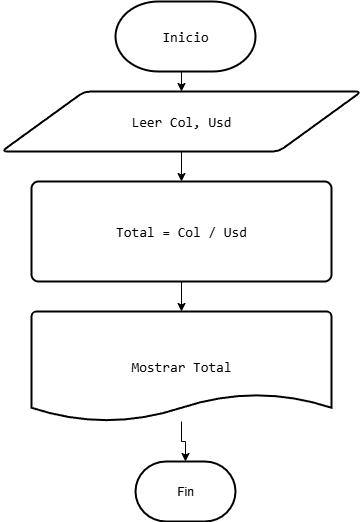

## *Ejercicio:*

Unz empresa importadora desea determinar cuantos dólares puedes adquirir con equis cantidad de dinero colombiano. Realice un diagrama de flujo y pseudocódigo que representen el álgoritmo para tal fin.

## Pseudocódigo:

````
Inicio
Leer Col, Usd
Total = Col / Usd
Mostrar Total
Fin 
````
## Diagrama de flujo:
